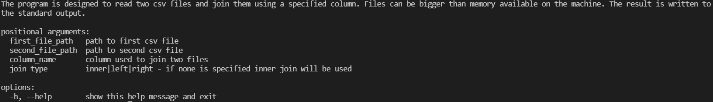

# Custom join

## Package manager used
```Bash
Anaconda
```
## Python version
```Bash
Python 3.10.0
```
## Brief Description
### 1. What the program does?
The program is designed to read two csv files and join them using a specified column. Files can be bigger than memory available on the machine. The result is written to the standard output.
### 2. How to run the program?
#### a) You can simply download source files and run command:
```Bash
python main.py file_path file_path column_name join_type
```

### Mandatory arguments:
- ```Bash
  file_path
  ```
    As file_path the program is accepting only path to csv files conform to the rfc4180. Otherwise, some unexpected behavior may be encountered.
- ```Bash
  column_name
  ```
    This argument specifies which column will be used for joining two files together


### Nonmandatory argumet:
 ```Bash
join_type
```
If none is specified, the inner join will be used. It's the simplest and most common form of join, also SQL uses inner join as the default join type.

How to specified join type?
```Bash
inner|left|right
```

### Example usage:
```Bash
python main.py important_data.csv other_data.csv ID left
```

### Hel command
```Bash
python main.py --help
```


### How the program works on inner join example:
We have two files: first_data.csv second_data.csv
- Firstly, we are dividing the second file into many small ones, each one has limited by CHUNK_SIZE number of lines.
- Secondly, we are creating a dictionary where keys are indexes of column given by the user and values are lists of files that contains given indexes.
- Thirdly, we are reading first file one row at a time, we are checking the value of a key column and checking in the dictionary in which files we can find matching rows.
- In the end, we are using multithreading for searching rows, combining them, and printing to standard output.

### What was tested and what wasn't?
I created 2 datasets (folder example_data) and joined them using inner, left and right join. Then I compared results of my program to the results of SQL join with the same data. Everything was identical. After that i changed CHUNK_SIZE variable to 3 to test if joining with file partitining is working. Again i compared result with SQL queries in evertyhing matched.
I also generated 2 big csv files with random data and joined them together. There was no issue with memory. I didn't check the result of this operation, because partitioning was check before.

### Python libraries that are perfect for joining two large CSV files:
```Bash
  Dask, Pandas, NumPy
```